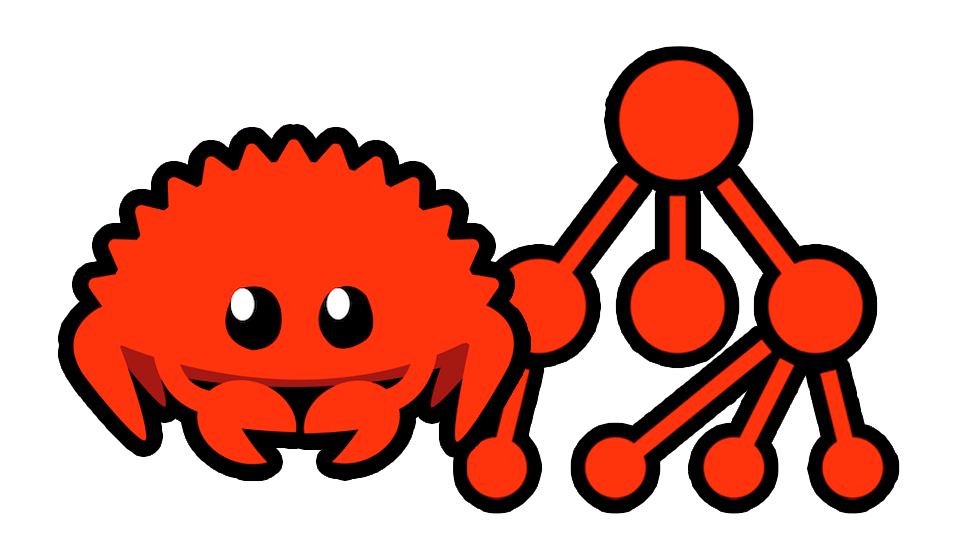

  
  
  
  
  <!--  -->
  

 

  

  <h2 align="center">Rust Data Structure</h2>

  

    A project with the objective of introducing the main concepts about data structure using Rust!
     
    <a href="https://www.rust-lang.org/learn"><strong>Explore the docs and learn Rust »</strong></a>
     
     
    <a href="https://github.com/lanjoni/rust-data-structure/issues">Report Bug</a>
    ·
    <a href="https://github.com/lanjoni/rust-data-structure/issues">Request Feature</a>
  

## About The Project

This project aims to carry out a complete approach for several subjects that involve concepts related to data structure and its applications using the Rust programming language.

The importance of having a good base on data structure and the desire to learn to apply the main concepts using the Rust programming language were the main reasons that motivated me to start this project, therefore, interweaving with all the content that I've been studying I felt the need to create something that could both help me in my studies and serve as an aid to anyone who wants it.

All code developed will serve as a basis for your codes, exemplifying the applications of each one by removing the already compiled files, so you can implement each variation as you wish.

## Roadmap

- [Introduction](https://github.com/lanjoni/rust-data-structure/tree/main/content/intro)
  - [What are data structures?](https://github.com/lanjoni/rust-data-structure/tree/main/content/intro/whatare.md)
  - [Types of data structures](https://github.com/lanjoni/rust-data-structure/tree/main/content/intro/typesofdata.md)
- [Linear data structures](https://github.com/lanjoni/rust-data-structure/tree/main/content/linear)
  - [Array](https://github.com/lanjoni/rust-data-structure/tree/main/content/linear/array)
  - [Stack](https://github.com/lanjoni/rust-data-structure/tree/main/content/linear/stack)
  - [Queue](https://github.com/lanjoni/rust-data-structure/tree/main/content/linear/queue)
  - [Linked list](https://github.com/lanjoni/rust-data-structure/tree/main/content/linear/linked)
- [Tree data structures](https://github.com/lanjoni/rust-data-structure/tree/main/content/tree)
  - [Binary tree](https://github.com/lanjoni/rust-data-structure/tree/main/content/tree/binary-tree)
- [Hash tables](https://github.com/lanjoni/rust-data-structure/tree/main/content/hash)
- [Graph data structures](https://github.com/lanjoni/rust-data-structure/tree/main/content/graph)
  - [Adjacency matrix](https://github.com/lanjoni/rust-data-structure/tree/main/content/graph/matrix)
  - [Adjacency list](https://github.com/lanjoni/rust-data-structure/tree/main/content/graph/list)
  - [Adjacency set](https://github.com/lanjoni/rust-data-structure/tree/main/content/graph/set)

See the [open issues](https://github.com/lanjoni/rust-data-structure/issues) for a full list of proposed features (and known issues).

## Contributing

Contributions are what make the open source community such an amazing place to learn, inspire, and create. Any contributions you make are **greatly appreciated**.

If you have a suggestion that would make this better, please fork the repo and create a pull request. You can also simply open an issue with the tag "enhancement".
Don't forget to give the project a star! Thanks again!

1. Fork the Project
2. Create your Feature Branch (`git checkout -b feature/AmazingFeature`)
3. Commit your Changes (`git commit -m 'Add some AmazingFeature'`)
4. Push to the Branch (`git push origin feature/AmazingFeature`)
5. Open a Pull Request

## License

Distributed under the GNU GPL 3.0 License. See `LICENSE` for more information.

## Collaborators

* [lanjoni](https://github.com/lanjoni) -
  **João Lanjoni** <<guto@lanjoni.dev>> (he/him)
